<!-- devopsshack:header -->
> ☸️ **Kubernetes Mastery: Zero to Production** · by **DevOps Shack** · [YouTube](https://www.youtube.com/@devopsshack) · [Hindi channel](https://www.youtube.com/@shackverse) · [devopsshack.com](https://devopsshack.com)
<!-- /devopsshack:header -->

# Diagrams · Troubleshooting Decision Flows

## Playbook · Pod Stuck in Pending

Source: [Playbook · Pod Stuck in Pending](../05-troubleshooting-playbooks/01-pod-pending.md)

### 1. Decision flow

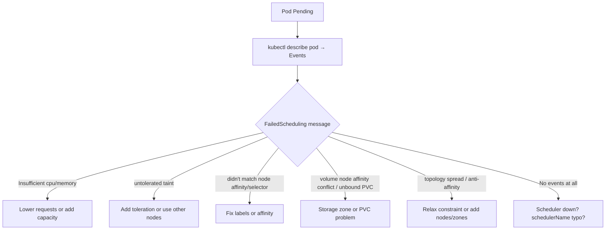
```mermaid
flowchart TD
    A[Pod Pending] --> B[kubectl describe pod → Events]
    B --> C{FailedScheduling message}
    C -->|Insufficient cpu/memory| D[Lower requests or add capacity]
    C -->|untolerated taint| E[Add toleration or use other nodes]
    C -->|didn't match node affinity/selector| F[Fix labels or affinity]
    C -->|volume node affinity conflict / unbound PVC| G[Storage zone or PVC problem]
    C -->|topology spread / anti-affinity| H[Relax constraint or add nodes/zones]
    C -->|No events at all| I[Scheduler down? schedulerName typo?]
```

## Playbook · CrashLoopBackOff

Source: [Playbook · CrashLoopBackOff](../05-troubleshooting-playbooks/02-crashloopbackoff.md)

### 2. Decision flow

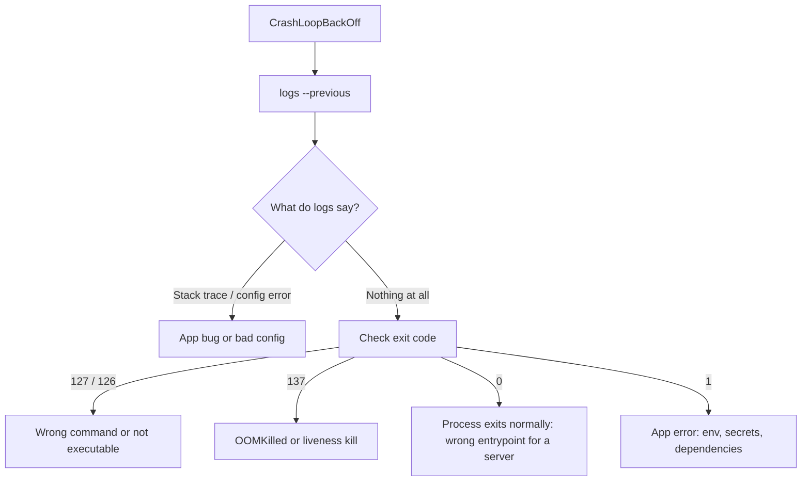
```mermaid
flowchart TD
    A[CrashLoopBackOff] --> B[logs --previous]
    B --> C{What do logs say?}
    C -->|Stack trace / config error| D[App bug or bad config]
    C -->|Nothing at all| E[Check exit code]
    E -->|127 / 126| F[Wrong command or not executable]
    E -->|137| G[OOMKilled or liveness kill]
    E -->|0| H[Process exits normally: wrong entrypoint for a server]
    E -->|1| I[App error: env, secrets, dependencies]
```

## Playbook · ErrImagePull / ImagePullBackOff

Source: [Playbook · ErrImagePull / ImagePullBackOff](../05-troubleshooting-playbooks/03-imagepullbackoff.md)

### 3. Decision flow

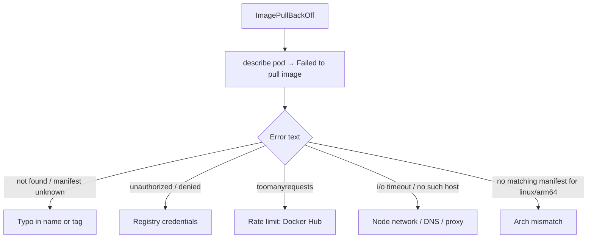
```mermaid
flowchart TD
    A[ImagePullBackOff] --> B[describe pod → Failed to pull image]
    B --> C{Error text}
    C -->|not found / manifest unknown| D[Typo in name or tag]
    C -->|unauthorized / denied| E[Registry credentials]
    C -->|toomanyrequests| F[Rate limit: Docker Hub]
    C -->|i/o timeout / no such host| G[Node network / DNS / proxy]
    C -->|no matching manifest for linux/arm64| H[Arch mismatch]
```

## Playbook · OOMKilled (Exit Code 137)

Source: [Playbook · OOMKilled (Exit Code 137)](../05-troubleshooting-playbooks/04-oomkilled.md)

### 4. Decision flow

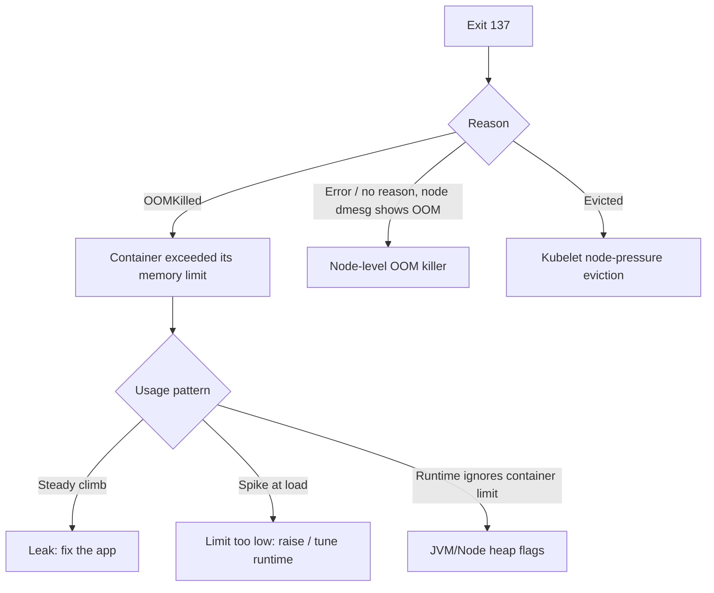
```mermaid
flowchart TD
    A[Exit 137] --> B{Reason}
    B -->|OOMKilled| C[Container exceeded its memory limit]
    B -->|Error / no reason, node dmesg shows OOM| D[Node-level OOM killer]
    B -->|Evicted| E[Kubelet node-pressure eviction]
    C --> F{Usage pattern}
    F -->|Steady climb| G[Leak: fix the app]
    F -->|Spike at load| H[Limit too low: raise / tune runtime]
    F -->|Runtime ignores container limit| I[JVM/Node heap flags]
```

## Playbook · CreateContainerConfigError

Source: [Playbook · CreateContainerConfigError](../05-troubleshooting-playbooks/05-createcontainerconfigerror.md)

### 5. Decision flow

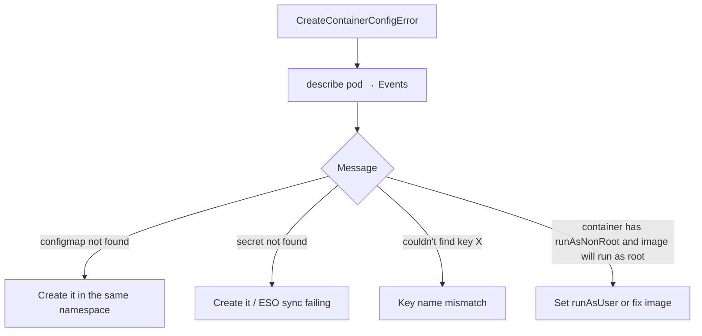
```mermaid
flowchart TD
    A[CreateContainerConfigError] --> B[describe pod → Events]
    B --> C{Message}
    C -->|configmap not found| D[Create it in the same namespace]
    C -->|secret not found| E[Create it / ESO sync failing]
    C -->|couldn't find key X| F[Key name mismatch]
    C -->|container has runAsNonRoot and image will run as root| G[Set runAsUser or fix image]
```

## Playbook · Pod Stuck in ContainerCreating

Source: [Playbook · Pod Stuck in ContainerCreating](../05-troubleshooting-playbooks/06-containercreating-stuck.md)

### 6. Decision flow

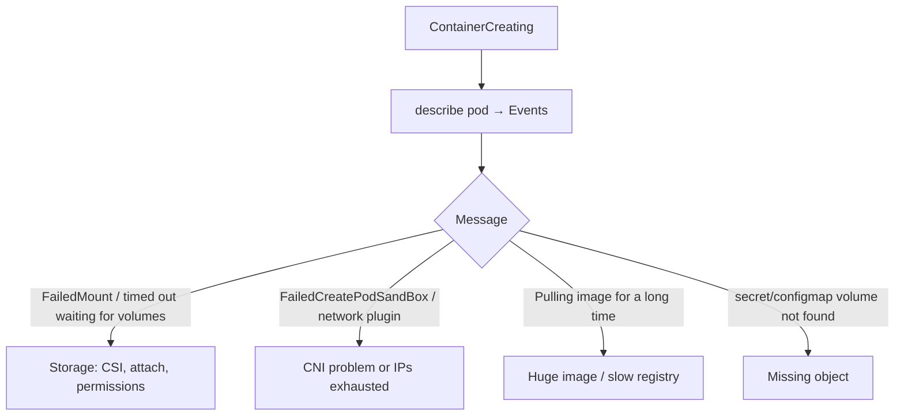
```mermaid
flowchart TD
    A[ContainerCreating] --> B[describe pod → Events]
    B --> C{Message}
    C -->|FailedMount / timed out waiting for volumes| D[Storage: CSI, attach, permissions]
    C -->|FailedCreatePodSandBox / network plugin| E[CNI problem or IPs exhausted]
    C -->|Pulling image for a long time| F[Huge image / slow registry]
    C -->|secret/configmap volume not found| G[Missing object]
```

## Playbook · Running but Not Ready (0/1)

Source: [Playbook · Running but Not Ready (0/1)](../05-troubleshooting-playbooks/07-running-not-ready.md)

### 7. Decision flow

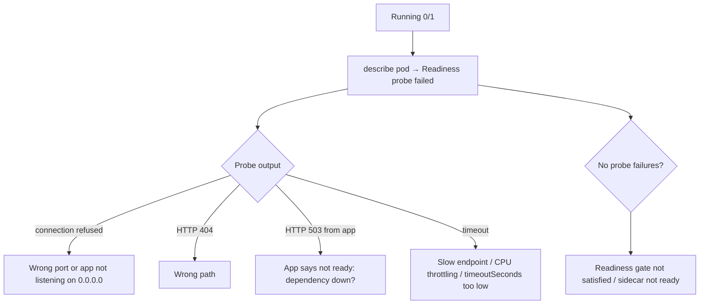
```mermaid
flowchart TD
    A[Running 0/1] --> B[describe pod → Readiness probe failed]
    B --> C{Probe output}
    C -->|connection refused| D[Wrong port or app not listening on 0.0.0.0]
    C -->|HTTP 404| E[Wrong path]
    C -->|HTTP 503 from app| F[App says not ready: dependency down?]
    C -->|timeout| G[Slow endpoint / CPU throttling / timeoutSeconds too low]
    B --> H{No probe failures?}
    H --> I[Readiness gate not satisfied / sidecar not ready]
```

## Playbook · Service Has No Endpoints / Connection Refused

Source: [Playbook · Service Has No Endpoints / Connection Refused](../05-troubleshooting-playbooks/08-service-no-endpoints.md)

### 8. Decision flow

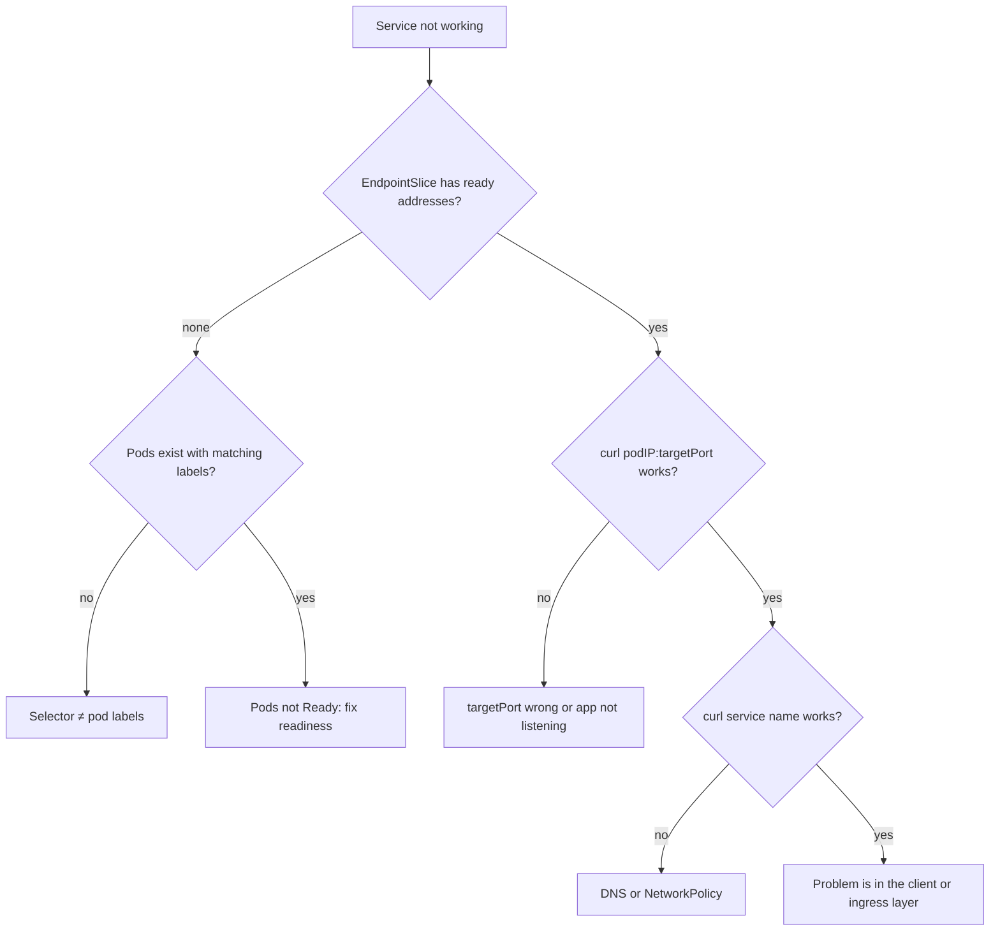
```mermaid
flowchart TD
    A[Service not working] --> B{EndpointSlice has ready addresses?}
    B -->|none| C{Pods exist with matching labels?}
    C -->|no| D[Selector ≠ pod labels]
    C -->|yes| E[Pods not Ready: fix readiness]
    B -->|yes| F{curl podIP:targetPort works?}
    F -->|no| G[targetPort wrong or app not listening]
    F -->|yes| H{curl service name works?}
    H -->|no| I[DNS or NetworkPolicy]
    H -->|yes| J[Problem is in the client or ingress layer]
```

## Playbook · DNS Failures & Slow DNS

Source: [Playbook · DNS Failures & Slow DNS](../05-troubleshooting-playbooks/09-dns-failures.md)

### 9. Decision flow

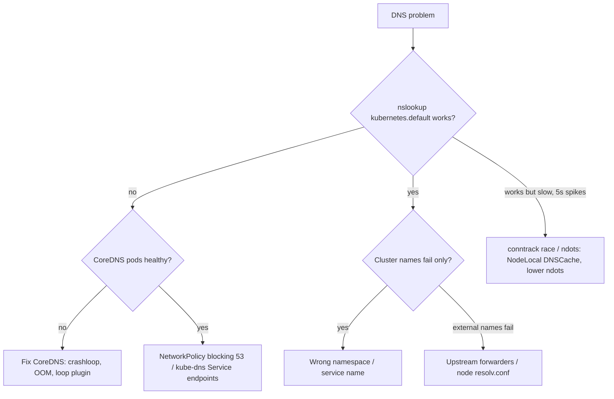
```mermaid
flowchart TD
    A[DNS problem] --> B{nslookup kubernetes.default works?}
    B -->|no| C{CoreDNS pods healthy?}
    C -->|no| D[Fix CoreDNS: crashloop, OOM, loop plugin]
    C -->|yes| E[NetworkPolicy blocking 53 / kube-dns Service endpoints]
    B -->|yes| F{Cluster names fail only?}
    F -->|yes| G[Wrong namespace / service name]
    F -->|external names fail| H[Upstream forwarders / node resolv.conf]
    B -->|works but slow, 5s spikes| I[conntrack race / ndots: NodeLocal DNSCache, lower ndots]
```

## Playbook · Ingress / Gateway Returns 404, 502, 503 or 504

Source: [Playbook · Ingress / Gateway Returns 404, 502, 503 or 504](../05-troubleshooting-playbooks/10-ingress-errors.md)

### 10. Decision flow

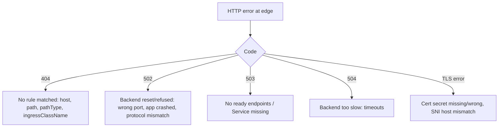
```mermaid
flowchart TD
    A[HTTP error at edge] --> B{Code}
    B -->|404| C[No rule matched: host, path, pathType, ingressClassName]
    B -->|502| D[Backend reset/refused: wrong port, app crashed, protocol mismatch]
    B -->|503| E[No ready endpoints / Service missing]
    B -->|504| F[Backend too slow: timeouts]
    B -->|TLS error| G[Cert secret missing/wrong, SNI host mismatch]
```

## Playbook · NetworkPolicy Blocking Traffic

Source: [Playbook · NetworkPolicy Blocking Traffic](../05-troubleshooting-playbooks/11-networkpolicy-blocking.md)

### 11. Decision flow

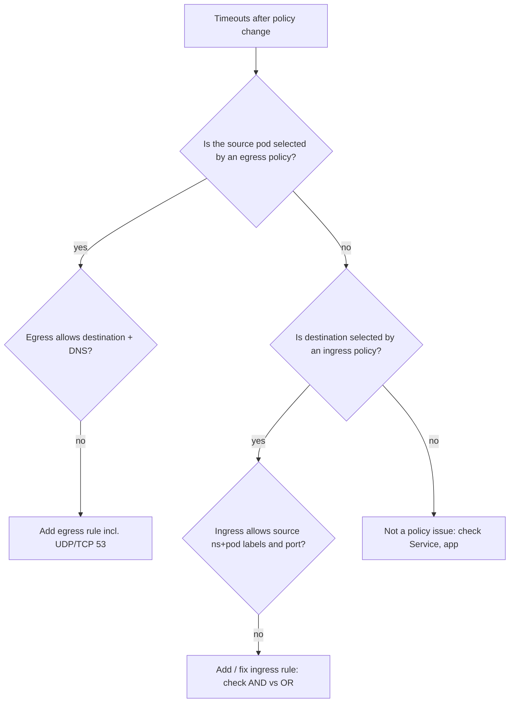
```mermaid
flowchart TD
    A[Timeouts after policy change] --> B{Is the source pod selected by an egress policy?}
    B -->|yes| C{Egress allows destination + DNS?}
    C -->|no| D[Add egress rule incl. UDP/TCP 53]
    B -->|no| E{Is destination selected by an ingress policy?}
    E -->|yes| F{Ingress allows source ns+pod labels and port?}
    F -->|no| G[Add / fix ingress rule: check AND vs OR]
    E -->|no| H[Not a policy issue: check Service, app]
```

## Playbook · Node NotReady

Source: [Playbook · Node NotReady](../05-troubleshooting-playbooks/12-node-notready.md)

### 12. Decision flow

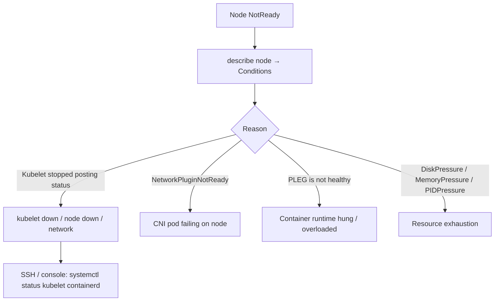
```mermaid
flowchart TD
    A[Node NotReady] --> B[describe node → Conditions]
    B --> C{Reason}
    C -->|Kubelet stopped posting status| D[kubelet down / node down / network]
    C -->|NetworkPluginNotReady| E[CNI pod failing on node]
    C -->|PLEG is not healthy| F[Container runtime hung / overloaded]
    C -->|DiskPressure / MemoryPressure / PIDPressure| G[Resource exhaustion]
    D --> H[SSH / console: systemctl status kubelet containerd]
```

## Playbook · Evictions & Node Pressure

Source: [Playbook · Evictions & Node Pressure](../05-troubleshooting-playbooks/13-node-pressure-evictions.md)

### 13. Decision flow

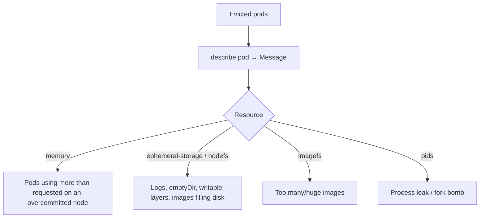
```mermaid
flowchart TD
    A[Evicted pods] --> B[describe pod → Message]
    B --> C{Resource}
    C -->|memory| D[Pods using more than requested on an overcommitted node]
    C -->|ephemeral-storage / nodefs| E[Logs, emptyDir, writable layers, images filling disk]
    C -->|imagefs| F[Too many/huge images]
    C -->|pids| G[Process leak / fork bomb]
```

## Playbook · PVC Stuck in Pending

Source: [Playbook · PVC Stuck in Pending](../05-troubleshooting-playbooks/14-pvc-pending.md)

### 14. Decision flow

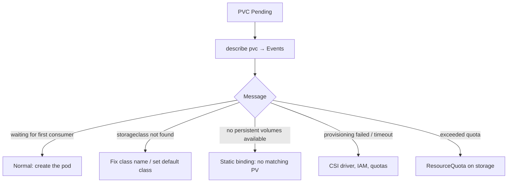
```mermaid
flowchart TD
    A[PVC Pending] --> B[describe pvc → Events]
    B --> C{Message}
    C -->|waiting for first consumer| D[Normal: create the pod]
    C -->|storageclass not found| E[Fix class name / set default class]
    C -->|no persistent volumes available| F[Static binding: no matching PV]
    C -->|provisioning failed / timeout| G[CSI driver, IAM, quotas]
    C -->|exceeded quota| H[ResourceQuota on storage]
```

## Playbook · Multi-Attach Error

Source: [Playbook · Multi-Attach Error](../05-troubleshooting-playbooks/15-multi-attach-error.md)

### 15. Decision flow

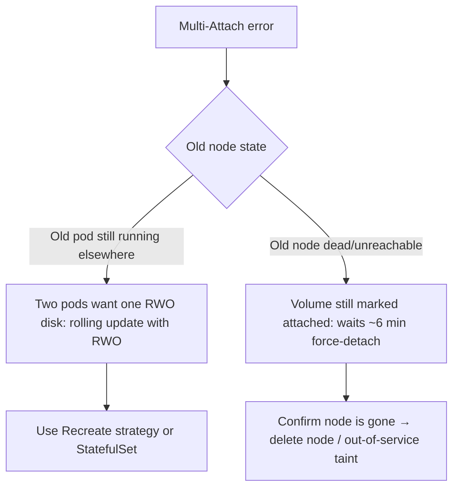
```mermaid
flowchart TD
    A[Multi-Attach error] --> B{Old node state}
    B -->|Old pod still running elsewhere| C[Two pods want one RWO disk: rolling update with RWO]
    B -->|Old node dead/unreachable| D[Volume still marked attached: waits ~6 min force-detach]
    C --> E[Use Recreate strategy or StatefulSet]
    D --> F[Confirm node is gone → delete node / out-of-service taint]
```

## Playbook · Namespace Stuck in Terminating

Source: [Playbook · Namespace Stuck in Terminating](../05-troubleshooting-playbooks/16-namespace-stuck-terminating.md)

### 16. Decision flow

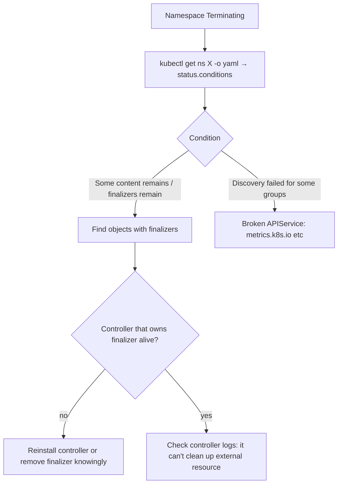
```mermaid
flowchart TD
    A[Namespace Terminating] --> B[kubectl get ns X -o yaml → status.conditions]
    B --> C{Condition}
    C -->|Some content remains / finalizers remain| D[Find objects with finalizers]
    C -->|Discovery failed for some groups| E[Broken APIService: metrics.k8s.io etc]
    D --> F{Controller that owns finalizer alive?}
    F -->|no| G[Reinstall controller or remove finalizer knowingly]
    F -->|yes| H[Check controller logs: it can't clean up external resource]
```

## Playbook · Pod Stuck in Terminating

Source: [Playbook · Pod Stuck in Terminating](../05-troubleshooting-playbooks/17-pod-stuck-terminating.md)

### 17. Decision flow

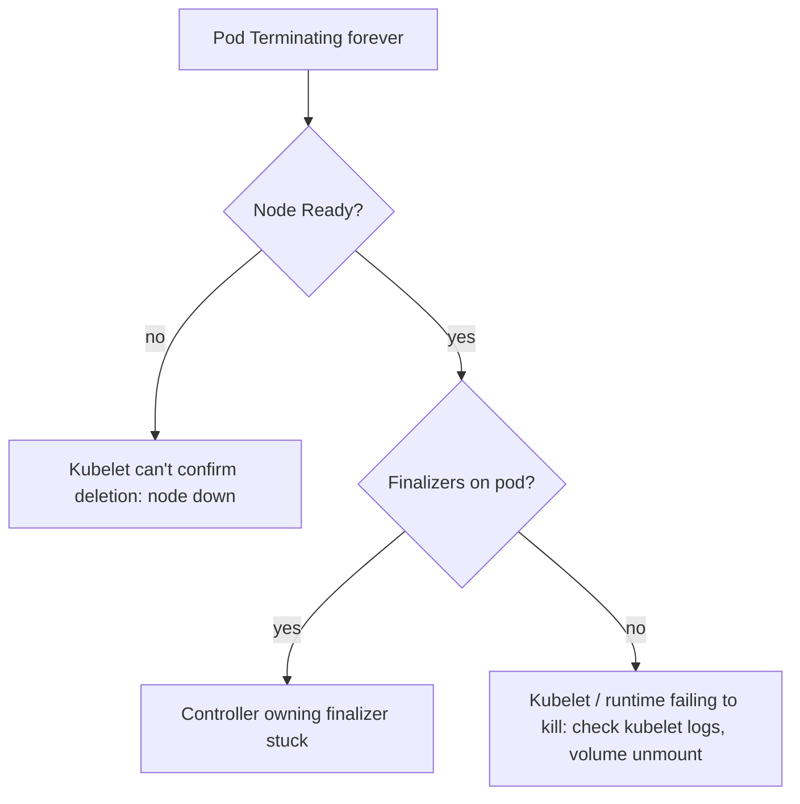
```mermaid
flowchart TD
    A[Pod Terminating forever] --> B{Node Ready?}
    B -->|no| C[Kubelet can't confirm deletion: node down]
    B -->|yes| D{Finalizers on pod?}
    D -->|yes| E[Controller owning finalizer stuck]
    D -->|no| F[Kubelet / runtime failing to kill: check kubelet logs, volume unmount]
```

## Playbook · Deployment Rollout Stuck

Source: [Playbook · Deployment Rollout Stuck](../05-troubleshooting-playbooks/18-rollout-stuck.md)

### 18. Decision flow

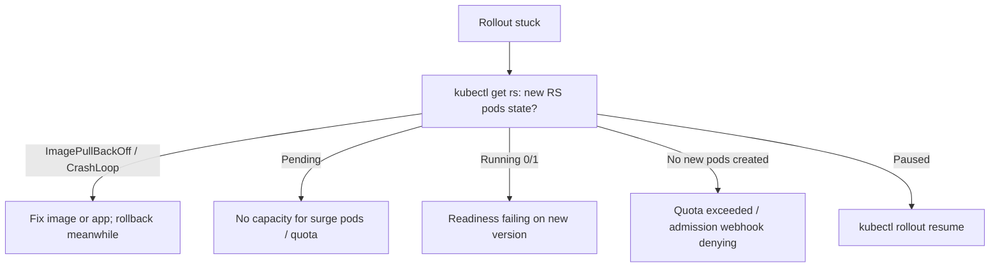
```mermaid
flowchart TD
    A[Rollout stuck] --> B[kubectl get rs: new RS pods state?]
    B -->|ImagePullBackOff / CrashLoop| C[Fix image or app; rollback meanwhile]
    B -->|Pending| D[No capacity for surge pods / quota]
    B -->|Running 0/1| E[Readiness failing on new version]
    B -->|No new pods created| F[Quota exceeded / admission webhook denying]
    B -->|Paused| G[kubectl rollout resume]
```

## Playbook · HPA Not Scaling

Source: [Playbook · HPA Not Scaling](../05-troubleshooting-playbooks/19-hpa-not-scaling.md)

### 19. Decision flow

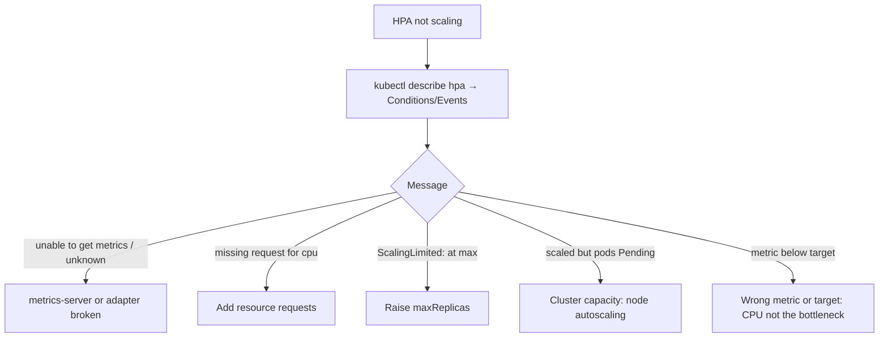
```mermaid
flowchart TD
    A[HPA not scaling] --> B[kubectl describe hpa → Conditions/Events]
    B --> C{Message}
    C -->|unable to get metrics / unknown| D[metrics-server or adapter broken]
    C -->|missing request for cpu| E[Add resource requests]
    C -->|ScalingLimited: at max| F[Raise maxReplicas]
    C -->|scaled but pods Pending| G[Cluster capacity: node autoscaling]
    C -->|metric below target| H[Wrong metric or target: CPU not the bottleneck]
```

## Playbook · CPU Throttling & Latency Spikes

Source: [Playbook · CPU Throttling & Latency Spikes](../05-troubleshooting-playbooks/20-cpu-throttling-latency.md)

### 20. Decision flow

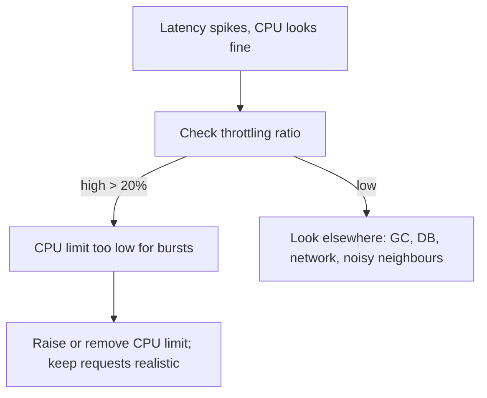
```mermaid
flowchart TD
    A[Latency spikes, CPU looks fine] --> B[Check throttling ratio]
    B -->|high > 20%| C[CPU limit too low for bursts]
    C --> D[Raise or remove CPU limit; keep requests realistic]
    B -->|low| E[Look elsewhere: GC, DB, network, noisy neighbours]
```

## Playbook · API Server Slow or Unavailable

Source: [Playbook · API Server Slow or Unavailable](../05-troubleshooting-playbooks/21-apiserver-slow-down.md)

### 21. Decision flow

```mermaid
flowchart TD
    A[API slow/down] --> B{Can you reach /readyz?}
    B -->|no| C[LB / network / apiserver pods down]
    B -->|yes, slow| D{readyz?verbose failing check}
    D -->|etcd| E[etcd slow or no quorum]
    D -->|ok| F[Overload: APF rejections, heavy LIST clients, webhooks]
    C --> G[On CP node: crictl ps / logs kube-apiserver]
```

## Playbook · etcd Problems: Latency, NOSPACE, Lost Quorum

Source: [Playbook · etcd Problems: Latency, NOSPACE, Lost Quorum](../05-troubleshooting-playbooks/22-etcd-problems.md)

### 22. Decision flow

```mermaid
flowchart TD
    A[etcd issue] --> B{Symptom}
    B -->|database space exceeded| C[Compact + defrag + disarm alarm; raise quota]
    B -->|leader changes, slow requests| D[Disk fsync latency / network]
    B -->|no leader / no quorum| E[Restore members or restore snapshot]
    B -->|member unhealthy| F[Replace member: remove + add]
```

## Playbook · Admission Webhook Blocking the Cluster

Source: [Playbook · Admission Webhook Blocking the Cluster](../05-troubleshooting-playbooks/23-webhook-blocking.md)

### 23. Decision flow

```mermaid
flowchart TD
    A[Webhook errors] --> B{Webhook backend healthy?}
    B -->|no endpoints| C[Webhook pods down: they may be blocked by their own webhook]
    B -->|timeouts| D[Network policy / slow webhook / wrong CA]
    C --> E{failurePolicy}
    E -->|Fail| F[Temporarily set Ignore or exclude namespaces, restore webhook]
```

## Playbook · Expired Certificates

Source: [Playbook · Expired Certificates](../05-troubleshooting-playbooks/24-certificates-expired.md)

### 24. Decision flow

```mermaid
flowchart TD
    A[x509 expired] --> B{Which cert?}
    B -->|kubectl → API| C[admin.conf client cert / API server cert]
    B -->|kubelet → API| D[kubelet client cert rotation failed]
    B -->|API → webhook| E[Webhook serving cert]
    B -->|Browser → ingress| F[cert-manager renewal failing]
```

## Playbook · RBAC Forbidden (403)

Source: [Playbook · RBAC Forbidden (403)](../05-troubleshooting-playbooks/25-rbac-forbidden.md)

### 25. Decision flow

```mermaid
flowchart TD
    A[403 Forbidden] --> B[Read the message: user, verb, resource, group, namespace]
    B --> C[kubectl auth can-i ... --as]
    C --> D{Binding exists?}
    D -->|no| E[Create Role/ClusterRole + binding]
    D -->|yes| F{Subject exact? kind/name/namespace/group}
    F -->|mismatch| G[Fix subject: SA namespace, group claim]
    F -->|ok| H[Rule missing verb/resource/apiGroup/subresource]
```

## Playbook · 5xx Errors During Every Deploy

Source: [Playbook · 5xx Errors During Every Deploy](../05-troubleshooting-playbooks/26-errors-during-deploys.md)

### 26. Decision flow

```mermaid
flowchart TD
    A[Errors during rollout] --> B{When do errors occur?}
    B -->|As new pods start| C[Readiness passes too early: cold caches, warm-up]
    B -->|As old pods stop| D[No graceful shutdown: endpoint removal races SIGTERM]
    B -->|Throughout| E[maxUnavailable too high / not enough capacity]
    D --> F[preStop sleep + SIGTERM handling + grace period]
```

## Playbook · Node Autoscaler Not Adding or Removing Nodes

Source: [Playbook · Node Autoscaler Not Adding or Removing Nodes](../05-troubleshooting-playbooks/27-node-autoscaler-not-scaling.md)

### 27. Decision flow

```mermaid
flowchart TD
    A[Autoscaler issue] --> B{Direction}
    B -->|No scale up| C[Check autoscaler logs: why pod can't fit any node group]
    C --> D[Max size reached / instance quota / constraints no group satisfies]
    B -->|No scale down| E[Blockers: PDB, local storage, non-controller pods, annotations, utilisation threshold]
```

## Playbook · kubectl Can't Connect to the Cluster

Source: [Playbook · kubectl Can't Connect to the Cluster](../05-troubleshooting-playbooks/28-kubectl-cannot-connect.md)

### 28. Decision flow

```mermaid
flowchart TD
    A[kubectl error] --> B{Message}
    B -->|localhost:8080 refused| C[No kubeconfig loaded]
    B -->|i/o timeout / no such host| D[Network: VPN, private endpoint, IP allowlist]
    B -->|Unauthorized| E[Expired token/cert, wrong user, IAM mapping]
    B -->|x509 unknown authority| F[Wrong CA in kubeconfig]
    B -->|Forbidden| G[Auth works; RBAC missing]
```

## Playbook · exec format error (Architecture Mismatch)

Source: [Playbook · exec format error (Architecture Mismatch)](../05-troubleshooting-playbooks/29-exec-format-error.md)

### 29. Decision flow

```mermaid
flowchart TD
    A[exec format error] --> B{Node arch vs image arch}
    B -->|arm64 node, amd64-only image| C[Build multi-arch or pin pods to amd64]
    B -->|matching arch| D[Script missing shebang / CRLF line endings / wrong binary]
```

## Playbook · Cluster Upgrade Gone Wrong

Source: [Playbook · Cluster Upgrade Gone Wrong](../05-troubleshooting-playbooks/30-upgrade-gone-wrong.md)

### 30. Decision flow

```mermaid
flowchart TD
    A[Post-upgrade failure] --> B{Symptom}
    B -->|no matches for kind X in version Y| C[Removed API version: migrate manifests]
    B -->|Add-on crashlooping| D[Add-on incompatible: upgrade CNI/CSI/ingress/operator]
    B -->|Nodes NotReady| E[Kubelet flags removed / version skew / runtime config]
    B -->|Drain stuck| F[PDB with zero disruptions]
    B -->|Subtle behaviour change| G[Read changelog: defaults, feature gates]
```

## 05 · Troubleshooting Playbooks

Source: [05 · Troubleshooting Playbooks](../05-troubleshooting-playbooks/README.md)

### 31. Start here: which playbook?

```mermaid
flowchart TD
    S[Something is wrong] --> A{kubectl get pods}
    A -->|Pending| P01[01 Pending]
    A -->|ImagePullBackOff| P03[03 Image pull]
    A -->|CrashLoopBackOff| P02[02 CrashLoop]
    A -->|OOMKilled| P04[04 OOMKilled]
    A -->|CreateContainerConfigError| P05[05 Config error]
    A -->|ContainerCreating| P06[06 ContainerCreating]
    A -->|Running 0/1| P07[07 Not Ready]
    A -->|Running, users see errors| T{Where?}
    T -->|Inside cluster| P08[08 Service / 09 DNS / 11 NetworkPolicy]
    T -->|At the edge| P10[10 Ingress errors]
    T -->|Only during deploys| P26[26 Deploy errors]
    S --> N{kubectl get nodes}
    N -->|NotReady| P12[12 Node NotReady]
    S --> K{kubectl itself fails?}
    K -->|yes| P28[28 kubectl / 21 API server]
```

<!-- devopsshack:footer -->
---

  Made with ❤️ by <b><a href="https://devopsshack.com">DevOps Shack</a></b> · Part of <b>Kubernetes Mastery: Zero to Production</b> 
  <a href="https://www.youtube.com/@devopsshack">YouTube · DevOps Shack</a> · <a href="https://www.youtube.com/@shackverse">YouTube · DevOps Shack Hindi</a> · <a href="https://devopsshack.com">devopsshack.com</a> · <a href="https://www.instagram.com/devopsshack">Instagram · @devopsshack</a> 
  © DevOps Shack. Original content created by DevOps Shack. Free to learn from and share with credit to DevOps Shack. See <a href="../LICENSE">LICENSE</a>.

<!-- /devopsshack:footer -->
